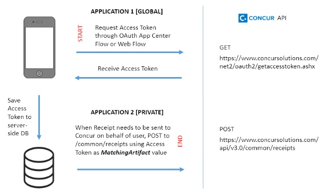
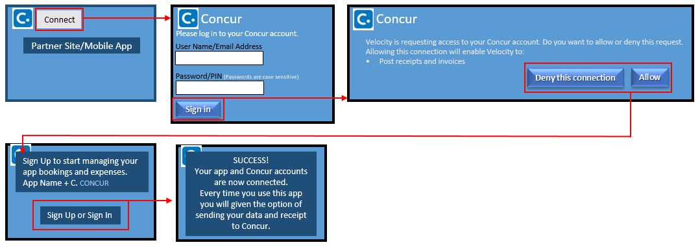
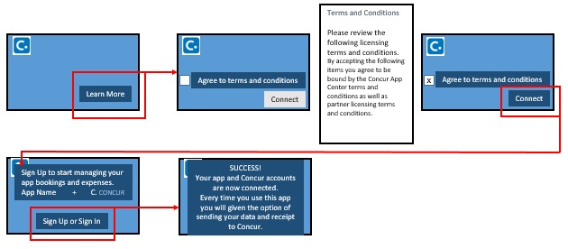

## Posting an eReceipt


At Concur, e-receipts are digital representations of receipts with both a receipt image and structured data. The e-receipts come from pre-authorized and trusted merchants and are transmitted to Concur using our **Receipt** API (not email) on behalf of individual users who have connected their accounts/profiles between Concur and the merchant in advance.

### Before You Begin

#### Accessing the Receipts API

Unlike all the other Concur API endpoints, the Receipts endpoint requires the Concur Platform team to configure your sandbox to enable access. You can make that request from the Support Page [here](https://developer.concur.com/tools-support/support.html). Remember to include the name of the Concur representative you with whom you are working in the form.


To enable e-receipt posting to Concur, ensure that you have completed the following:

- Your company must be qualified by the Concur Platform and Partner Solutions [business development team]( https://developer.concur.com/why-concur.html) and your company must have entered into a commercial agreement with Concur
- Ensure your app supports **BOTH** Concur’s [App Center flow](https://developer.concur.com/api-reference/authentication/authentication.html) so that travelers can authenticate from within Concur’s Mobile app; and Concur’s Web flow so that users can authenticate from within your app
- Ensure your app supports the ability to [connect your users to and from](https://developer.concur.com/api-reference/authentication/authentication.html#access-tokens) your app or website. 
- Ensure your app supports the ability to [disconnect](https://developer.concur.com/api-reference/authentication/authentication.html#revoke-single-access-token) the user from their account with you
- Ensure your app includes the ability to [refresh the Concur authentication token](https://developer.concur.com/api-reference/authentication/authentication.html#refreshing-access-token)
- Ensure your app includes the ability to respond appropriately to revoked token messages 
- Ensure that if your app currently generates a receipt image, (.png, .jpg,.tif. pdf or other image file) that you include it in your post to Concur. Concur generates a standard receipt for Partners who do not tender a receipt image. The standard receipt may not include additional fees and taxes collected the user’s locale like VAT.


#### Posting an eReceipt: Submitting expenses to Concur

Currently the Receipts service supports these three types of receipts: general purpose receipts, hotel receipts for either hospitality service or accommodation and ride receipt for a ride service. It is important to remember that the Receipts service only accepts receipts up to six months old. For more information, consult the Receipts article in the [developer.concur.com API Reference](https://developer.concur.com/api-reference/expense/receipts/index.html) materials.

This diagram explains how to send an e-receipt to Concur. Developers should remember to both ***STORE*** and ***USE*** the instance URL as well as the refresh token. 



The POST fields required for the Receipt endpoint are located in the official Concur developer page [here](https://developer.concur.com/receipts/post-receipt), and test it out in our Swagger page [here](https://www.concursolutions.com/api/docs/index.html).


#### Important
- Use the ERECPT scope. More details [here](https://developer.concur.com/oauth-20/web-flow) Search Term: ERECPT
- Use the easier Native Flow authentication for Application 2 in your sandbox to retrieve the user token 
- Ensure that your dates are recent. The Receipts endpoint rejects receipts with transaction dates older than six months


Refer to the sample Receipt POST body below for guidance:

```
JSON
{
  "Type": "Ride",
  "TransactionDateTime": "2014-06-16T16:03:24",
  "Amount": 88.6,
  "CurrencyCode": "USD",
  "MatchingFact": {
    "Type": "OAuth",
    "Value": "<insert access token here>"
  },
  "Merchant": {
    "Name": "RideMerchantName",
    "Location": {
      "Name": "RideMerchantLocationName",
      "Address": "RideMerchantAddress",
      "Address2": "RideMerchantAddress2",
      "City": "RideMerchantCity",
      "CountrySubdivisionCode": "WA",
      "CountryCode": "US",
      "PostalCode": "RPostalCode",
      "InternetAddress": "http://ridemerchanturl",
      "EmailAddress": "ridemerchant@email",
      "TelephoneNumber": "800-RMERCPH",
      "FaxNumber": "800-RMERCFX"
    }
  },
  "FormofPaymentCode": "CCARD",
  "PaymentCard": {
    "Type": "VI",
    "MaskedNumber": "4321",
    "AuthorizationCode": "PaymentAuthCode"
  },
  "RideDetail": {
    "StartDateTime": "2014-06-10T15:08:24.637928-07:00",
    "EndDateTime": "2014-06-10T15:48:24.637928-07:00",
    "DriverName": "RideDriverName",
    "VehicleNumber": "RideVehicleNumber",
    "DropoffLatitude": 47.4436655,
    "DropoffLongitude": -122.2982266,
    "LineItems": [
      {
        "SequenceNumber": 1,
        "Reference": "RideRefId01",
        "Description": "Ride Item 01 Description",
        "Description2": "Ride Item 01 Description2",
        "Quantity": 1,
        "Amount": 73.65
      },
      {
        "SequenceNumber": 2,
        "Reference": "RideRefId02",
        "Description": "Ride Item 02 Description",
        "Description2": "Ride Item 02 Description2",
        "Quantity": 1,
        "Amount": 4.95
      },
      {
        "SequenceNumber": 3,
        "Reference": "RideRefId03",
        "Description": "Ride Item 03 Description",
        "Description2": "Ride Item 03 Description2",
        "Quantity": 1,
        "Amount": 10
      }
    ]
  },
  "CustomFields": [
    {
      "Name": "RideCustomField01Name",
      "Value": "RideCustomField02Value"
    },
    {
      "Name": "RideCustomField02Name",
      "Value": "RideCustomField02Value"
    },
    {
      "Name": "RideCustomField03Name",
      "Value": "RideCustomField03Value"
    }
  ],
  "ImageBase64": "<insert Base64 representation of image"
}
```

Test your API in the [API Explorer](https://concurapi.readme.io/docs/post-e-receipt).  


#### If the user connection is initiated from the Partner site, it should follow Web Flow:



#### If the connection is initated from the Concur App Center, the user experience should follow App Center Flow:



#### Make us better at making your experience easier.
Share a Concur API process issue we can do better. Provide us with an explanation, screen shots and your recommendation [here](http://forum.developer.concur.com/).
